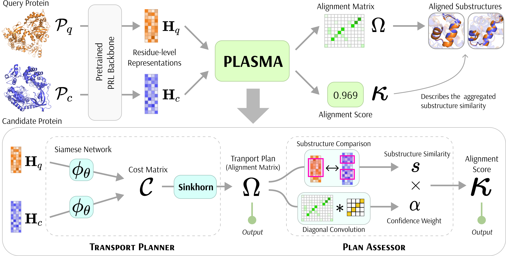

# PLASMA: Fast and Interpretable Protein Substructure Alignment via Optimal Transport



## Overview

**PLASMA** (**P**luggable **L**ocal **A**lignment via **S**inkhorn **MA**trix) is the first deep learning framework for efficient and interpretable residue-level protein substructure alignment using optimal transport. PLASMA addresses a critical gap in computational biology by enabling accurate identification and comparison of functionally important local structures—such as active sites, binding sites, and conserved motifs—that are essential for understanding protein function, evolution, and drug design.

Unlike existing methods that focus on global protein similarity or require predefined templates, PLASMA leverages optimal transport theory to discover meaningful correspondences between protein substructures, even when proteins share little overall structural similarity.

## The Problem PLASMA Solves

Protein local functional motifs represent the most critical components for understanding biological functions, as they directly mediate activities like catalysis, molecular recognition, and structural maintenance. However, existing computational methods face fundamental limitations:

- **Template-based methods** can only find known motifs and cannot discover novel similarities
- **Global structure alignment methods** are computationally expensive and miss local functional regions
- **Global embedding-based methods** compress information too coarsely, losing interpretable local alignments

With over 200 million protein structures now available from AlphaFold, there's an unprecedented opportunity to discover conserved functional patterns—but we need methods that can systematically identify local structural features that transcend traditional fold families.

## Key Innovation: Optimal Transport for Protein Alignment

PLASMA reformulates protein substructure alignment as a regularized optimal transport problem, using differentiable Sinkhorn iterations to compute biologically meaningful alignments. This approach naturally handles:

- **Partial matches** between substructures of different lengths
- **Variable-length alignments** without forcing artificial correspondences  
- **Local similarities** independent of global protein structure
- **Interpretable results** with clear alignment matrices and similarity scores

## Architecture

PLASMA consists of two complementary components:

1. **Transport Planner**: Computes optimal alignment matrices using learnable cost functions and Sinkhorn iterations
2. **Plan Assessor**: Transforms alignment matrices into interpretable similarity scores through diagonal convolution and confidence weighting

The framework operates on residue-level embeddings from any pre-trained protein language model, making it backbone-agnostic and broadly applicable.

## Key Advantages

- **50× faster** than structure-based methods (TM-Align, Foldseek) by operating on pre-computed embeddings
- **Superior accuracy** across diverse protein representation models (ProtBERT, ESM2, ProstT5, etc.)
- **Interpretable alignments** with normalized similarity scores and clear correspondence matrices
- **Parameter-free variant** (PLASMA-PF) provides strong performance without labeled data
- **Biological relevance** focuses on both geometrically and functionally similar regions
- **Robust generalization** to completely novel substructure types not seen during training

---

## Directory Structure

```
plasma/
├── configs/                           # Hydra configuration files
│   ├── backbone/                      # Backbone model configurations
│   │   ├── ESM2.yaml                  # ESM2 protein language model
│   │   ├── ProtBERT.yaml              # ProtBERT protein language model
│   │   ├── ProtT5.yaml                # ProtT5 protein language model
│   │   ├── Ankh.yaml                  # Ankh protein language model
│   │   ├── TM-Vec_and_ProstT5.yaml    # Combined TM-Vec and ProstT5 model
│   │   ├── ProtSSN.yaml               # Structure-based ProtSSN model
│   │   └── ...
│   ├── dataset_prep.yaml              # Dataset preparation configuration
│   ├── download_pdb.yaml              # PDB download configuration
│   ├── embed.yaml                     # Embedding generation configuration
│   ├── train.yaml                     # Model training configuration
│   └── ...
├── data/                              # Data directory
│   ├── raw/                           # Raw dataset CSV files
│   │   ├── motif.csv                  # Motif dataset
│   │   ├── binding_site.csv           # Binding site dataset
│   │   ├── active_site.csv            # Active site dataset
│   │   ├── domain.csv                 # Domain dataset
│   │   ├── evo.csv                    # Evolution dataset
│   │   └── full.csv                   # Combined dataset
│   ├── processed/                     # Processed datasets
│   │   └── {task}/                    # Task-specific processed data
│   │       └── split_{i}/             # Cross-validation splits
│   │           ├── train.pt           # Training pairs
│   │           ├── validation.pt      # Validation pairs
│   │           ├── test.pt            # Test pairs
│   │           ├── test_hard.pt       # Hard test pairs (unseen InterPro IDs)
│   │           └── metadata.json      # Split metadata
│   ├── pdb/                           # PDB structure files
│   │   └── raw/                       # Raw PDB files
│   │       └── {uid}.pdb              # Individual protein structures
│   └── embeddings/                    # Generated embeddings
│       └── {backbone_model}/          # Model-specific embeddings
│           ├── AA_embeddings/         # Amino acid level embeddings
│           │   └── {uid}.pt           # Per-protein embeddings
│           └── PR_embeddings/         # Protein level embeddings
│               └── {uid}.pt           # Per-protein embeddings
├── backbones/                         # Backbone model implementations
├── weights/                           # Pre-trained model weights
├── dataset_prep.py                    # Dataset preparation script
├── download_pdb.py                    # PDB download script
├── embed.py                           # Embedding generation script
├── train.py                           # Model training script
└── evaluate.py                        # Model evaluation script
```

## Getting Started

### 0. Environment Setup
```bash
uv sync
uv pip install pyg_lib torch_scatter torch_sparse torch_cluster torch_spline_conv -f https://data.pyg.org/whl/torch-2.8.0+cu126.html
```

### 1. Data Download and Preparation

#### Download Dataset CSVs
Download and prepare datasets from HuggingFace for specific tasks:

```bash
# Download datasets used in experiments
python dataset_prep.py task=motif,binding_site,active_site total_samples=20000 --multirun
```

This creates balanced positive/negative pairs and splits them into train/validation/test/test_hard sets with cross-validation splits.

#### Download PDB Structure Files (Optional)
For structure-based models like ProtSSN, download corresponding PDB files:

```bash
# Download PDB files for multiple tasks
python download_pdb.py
```

### 2. Generate Backbone Embeddings

Generate embeddings using various backbone models:

#### Sequence-based Models
```bash
python embed.py backbone=ESM2,ProtBERT,ProtT5,Ankh,TM-Vec_and_ProstT5 data_path=data/raw/active_site.csv,data/raw/binding_site.csv,data/raw/motif.csv --multirun
```
#### Hybrid Models
```bash
# ProtSSN embeddings (requires PDB files)
python embed.py backbone=ProtSSN data_path=data/raw/active_site.csv,data/raw/binding_site.csv,data/raw/motif.csv pdb_base_dir=data/pdb/raw --multirun
```

## Training

### Default Hyperparameters

```bash
python train.py -m backbone_model=prot_bert,ankh-base,TM-Vec,ProstT5,prot_t5_xl_half_uniref50-enc,esm2_t33_650M_UR50D,ProtSSN \ 
  task=active_site,binding_site,motif \
  split=0,1,2 \
  dataset_fraction=0.1 \
  hydra/launcher=joblib hydra.launcher.n_jobs=8 --multirun
```

### Hyperparameter Sweeps

The following commands were used for comprehensive hyperparameter optimization:

#### Dataset Size Experiments
```bash
python train.py backbone_model=prot_bert,ankh-base,TM-Vec,ProstT5,prot_t5_xl_half_uniref50-enc,esm2_t33_650M_UR50D,ProtSSN \
  task=active_site,binding_site,motif \
  split=0,1,2 \
  dataset_fraction=0.003,0.01,0.03,0.1,0.3,1 \
  launcher=qsub launcher.walltime=00:30:00 --multirun
```

#### Temperature Tuning
```bash
python train.py backbone_model=prot_bert,ankh-base,TM-Vec,ProstT5,prot_t5_xl_half_uniref50-enc,esm2_t33_650M_UR50D,ProtSSN \
  task=active_site,binding_site,motif \
  split=0,1,2 \
  dataset_fraction=0.1 \
  omega.temperature=0.03,0.1,0.3,1,3 \
  launcher=qsub launcher.walltime=00:30:00 --multirun
```

#### Sinkhorn Iterations (T)
```bash
python train.py backbone_model=prot_bert,ankh-base,TM-Vec,ProstT5,prot_t5_xl_half_uniref50-enc,esm2_t33_650M_UR50D,ProtSSN \
  task=active_site,binding_site,motif \
  split=0,1,2 \
  dataset_fraction=0.1 \
  omega.n_iters=5,10,15,20,25,30,35 \
  launcher=qsub launcher.walltime=02:00:00 --multirun
```

#### Siamese Network Dimension
```bash
python train.py backbone_model=prot_bert,ankh-base,TM-Vec,ProstT5,prot_t5_xl_half_uniref50-enc,esm2_t33_650M_UR50D,ProtSSN \
  task=active_site,binding_site,motif \
  split=0,1,2 \
  dataset_fraction=0.1 \
  eta.hidden_dim=64,128,256,512,1024 \
  launcher=qsub launcher.walltime=01:00:00 --multirun
```

#### Residue Matching Threshold
```bash
python train.py backbone_model=prot_bert,ankh-base,TM-Vec,ProstT5,prot_t5_xl_half_uniref50-enc,esm2_t33_650M_UR50D,ProtSSN \
  task=active_site,binding_site,motif \
  split=0,1,2 \
  dataset_fraction=0.1 \
  score.threshold=0.25,0.375,0.5,0.625,0.75 \
  launcher=qsub launcher.walltime=01:00:00 --multirun
```

#### Diagonal Convolution Size (K)
```bash
python train.py backbone_model=prot_bert,ankh-base,TM-Vec,ProstT5,prot_t5_xl_half_uniref50-enc,esm2_t33_650M_UR50D,ProtSSN \
  task=active_site,binding_site,motif \
  split=0,1,2 \
  dataset_fraction=0.1 \
  score.K=1,3,6,10,15 \
  launcher=qsub launcher.walltime=01:00:00 --multirun
```

## Baseline Comparisons

### Alignment Methods
```bash
python eval_align_baselines.py \
  task=motif,active_site,binding_site \
  split=0,1,2 \
  alignment_method=foldseek,tm_align \
  launcher=qsub launcher.walltime=04:00:00 launcher.queue=huge launcher.resources.ngpus=0 --multirun
```

### EBA (https://git.scicore.unibas.ch/schwede/EBA)
```bash
python evaluate_pf.py \
  backbone_model=prot_bert,ankh-base,TM-Vec,ProstT5,prot_t5_xl_half_uniref50-enc,esm2_t33_650M_UR50D,ProtSSN \
  task=active_site,binding_site,motif \
  split=0,1,2 \
  launcher=qsub launcher.walltime=00:30:00 --multirun
```

### Backbones
```bash
python eval_baselines.py \
  backbone_model=prot_bert,ankh-base,TM-Vec,ProstT5,prot_t5_xl_half_uniref50-enc,esm2_t33_650M_UR50D,ProtSSN \
  task=active_site,binding_site,motif \
  split=0,1,2 \
  launcher=qsub launcher.walltime=00:30:00 --multirun
```